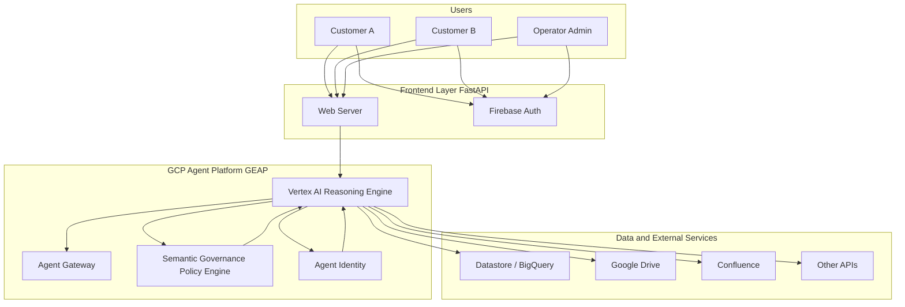

# Multi-Tenant Contract Analyst Agent (GEAP Demo)

Reference architecture and demo web application showcasing logical tenant isolation, user session identity binding, and real-time policy enforcement on the Gemini Enterprise Agent Platform (GEAP).

This repository contains a fully functional, multi-tenant Contract Analyst Agent built on Google Cloud Platform (GCP) using the Agent Development Kit (ADK) and Vertex AI Agent Engine.

The solution demonstrates robust **per-customer data isolation** using Google Cloud Agent Identity, allowing a single agent deployment to securely serve multiple customers (e.g., Customer A and Customer B) without cross-tenant data leakage.

---

## 🏗️ Architecture Overview

The solution consists of two main components:

1.  **ADK Agent (`agent/`)**: Tenant-agnostic by construction. Deployed to Vertex AI Agent Engine. It relies on Agent Identity to resolve credentials scoped to the calling session's `user_id`.
2.  **Frontend (`frontend/`)**: A FastAPI application handling Firebase Authentication, role-based routing (Operator vs. Customer), and the OAuth redirect flow.

### 🗺️ Architecture Diagram



---

## 📋 Prerequisites

Before you begin, ensure you have the following installed and configured:

*   **Google Cloud SDK (`gcloud`)**: Authenticated to your GCP Project.
*   **Python 3.11+**: Installed on your local machine.
*   **Firebase Project**: Linked to your GCP Project (for authentication).
*   **Git**: For version control.

Verify versions:
```bash
git --version
python3 --version          # 3.11+ recommended
gcloud --version
```

---

## ⚙️ Configuration Variables

The following environment variables are used throughout the setup. Set them in your terminal session or a `.env` file.

| Variable | Description | Example |
| :--- | :--- | :--- |
| `GOOGLE_CLOUD_PROJECT` | Your GCP Project ID | `my-secure-agent-project` |
| `GOOGLE_CLOUD_LOCATION` | Desired region for Vertex AI | `us-central1` |
| `STAGING_BUCKET` | GCS Bucket for deployment artifacts | `gs://my-secure-agent-staging` |
| `OAUTH_CONTINUE_URI` | Frontend callback for OAuth | `http://localhost:8080/oauth/validateUserId` |
| `ORGANIZATION_ID` | Your GCP Organization ID | `1234567890` |

---

## 🚀 Full Setup Walkthrough

### Step 0 - Authenticate

```bash
gcloud auth login
gcloud config set project YOUR_PROJECT_ID
gcloud auth application-default login
```
The last command lets local Python (Firebase Admin SDK, the deploy script) authenticate without a key file.

### Step 1 - Bootstrap the Project

Enable required APIs, create the staging bucket, and setup the agent's service account.

```bash
cd agent
export PROJECT_ID="your-gcp-project-id"
export LOCATION="us-central1"
export STAGING_BUCKET="your-gcp-project-id-agent-staging"

bash setup/01_bootstrap_project.sh
```

### Step 2 - Register OAuth Clients (Manual Steps)

Configure Google OAuth for Google Drive access:
1.  Go to **APIs & Services > Credentials** in Google Cloud Console.
2.  Create an **OAuth client ID** (Web application).
3.  Set up the Consent Screen if prompted (App name: "Contract Analyst Agent").
4.  Add Authorized Redirect URI: `http://localhost:8080/oauth/validateUserId` (for local testing).
5.  Save the **Client ID** and **Client Secret**.

### Step 3 - Create Agent Identity Auth Providers

Register the connectors with Agent Identity.

```bash
export ORGANIZATION_ID="your-org-id"          # gcloud organizations list
export GOOGLE_DRIVE_CLIENT_ID="paste-from-step-2"
export GOOGLE_DRIVE_CLIENT_SECRET="paste-from-step-2"
export CONTINUE_URI="http://localhost:8080/oauth/validateUserId"

bash setup/03_create_auth_providers.sh
```

### Step 4 - Bind Auth Providers to Tools

Bind the connectors to the agent's functional endpoints.

```bash
bash setup/04_create_registry_bindings.sh
```

### Step 5 - Deploy the Agent

Deploy the ADK agent to Vertex AI Agent Engine.

```bash
pip install -r requirements.txt
export GOOGLE_CLOUD_PROJECT="your-gcp-project-id"
export GOOGLE_CLOUD_LOCATION="us-central1"
export STAGING_BUCKET="gs://your-gcp-project-id-agent-staging"
export OAUTH_CONTINUE_URI="http://localhost:8080/oauth/validateUserId"

python3 setup/05_deploy_agent.py
```
*Note: Copy the **Reasoning Engine ID** from the output.*

#### Step 5a - Apply Agent Gateway (Egress)

If using an Egress Gateway for external calls isolation:

```bash
python setup/05_update_agent_gateway.py
```

### Step 6 - Grant Agent Access to Connectors

Re-run the Auth Provider setup with the Agent's ID to grant it IAM access.

```bash
export REASONING_ENGINE_ID="your-reasoning-engine-id"
bash setup/03_create_auth_providers.sh
```

### Step 7 - Enable Firebase Auth (Manual)

1.  Go to [Firebase Console](https://console.firebase.google.com/) -> Add project -> use your *existing* GCP project.
2.  Build -> Authentication -> Sign-in method -> enable Google.
3.  Project settings -> General -> Your apps -> Add app -> Web.
4.  Copy `apiKey`, `authDomain`, `projectId`, `appId`.

#### Step 7a - Populate User Configurations (Datastore)

Configure which authentication strategy (DWD vs 3LO) to use per user in Datastore.

```bash
python setup_user_configs.py
```
*Note: Edit `setup_user_configs.py` before running to map your specific test users/Firebase UIDs to the desired strategies.*

### Step 8 - Configure & Run Frontend

Set up the FastAPI frontend to talk to the deployed agent.

1.  Navigate to frontend dir: `cd ../frontend`
2.  Copy `frontend/.env.example` to `frontend/.env`.
3.  Fill in your Firebase, GCP, and Agent Engine resource names.
4.  Run the frontend:

```bash
pip install -r requirements.txt
export $(grep -v '^#' .env | xargs)
uvicorn app.main:app --reload --port 8080
```

### Step 9 - Grant yourself Operator access

New terminal, same env vars loaded:

```bash
python3 setup/02_set_operator_claim.py your-email@gmail.com
```

### Step 10 - Test it

1.  Open `http://localhost:8080/login`
2.  Sign in as the email you just granted Operator to -> lands on `/admin`
3.  Incognito/private window, sign in as a *different* Google account (Customer) -> lands on `/chat`
4.  As that account: Connect Google Drive, complete consent, ask about a contract in that account's Drive.

---

## 🔒 Security & Tenant Isolation

*   **Zero Hardcoding**: No customer credentials or tenant names are embedded in prompts.
*   **Session Binding**: Isolation is enforced at the tool layer where Agent Identity resolves credentials scoped strictly to the active session's `user_id`.
*   **Role-Based Access**: Frontend ensures only authenticated users with valid session cookies can interact with the agent.

---

## 🎬 Demo Flow

### Step 1: User Personas
The demo distinguishes between an **Operator** (Admin) and **Customers** (Tenants) via custom claims in Firebase.

### Step 2: Single Shared Agent
The Contract Analyst Agent is tenant-agnostic. Both Customer A and Customer B call the same Reasoning Engine resource.

### Step 3: Connector Isolation
When Customer A connects Drive, their calls are scoped strictly to their Drive via per-user OAuth grants resolved by Agent Identity.

### Step 4: Multi-Tenant Verification
Sign out and sign in as Customer B. Repeat the process. Verify that Customer B only sees their own files, demonstrating isolation without code branching.

---

## 🔧 Operator Notes

### Revoking a Customer's Drive Grant
Disabling a customer in the admin console revokes their login but **not** their Drive OAuth grant. To fully offboard:
1.  **Direct Revocation**: Have the user revoke access at [Google Account Permissions](https://myaccount.google.com/permissions).
2.  **Provider Deactivation**: Disable the connector globally via `gcloud` (Emergency only):
    ```bash
    gcloud alpha agent-identity connectors update google-drive-3lo --location=LOCATION --disable
    ```

---

## 🛠️ Troubleshooting & Known Issues

### Firebase Session Cookies & Local Development

> [!IMPORTANT]
> The frontend application uses **Firebase Session Cookies** for secure authentication.

*   **In Production (GCP)**: The app runs using an attached Service Account (e.g., on Cloud Run). Session cookie creation works seamlessly.
*   **In Local Development**: If you are running the frontend locally and have authenticated via `gcloud auth application-default login` using your **User Account**, the Firebase Admin SDK function `create_session_cookie` will fail.
    *   **Reason**: User credentials cannot sign Firebase session cookies; only Service Account credentials can.
    *   **Workaround**: To run locally with full cookie support, you must use a **Service Account Key JSON file** and set the `GOOGLE_APPLICATION_CREDENTIALS` environment variable to point to it.

### Agent Ownership (e.g., "Grog")
When running `sync_agent_registry.py`, all discovered agents are set to "Operator" owned by default. Manually update BigQuery if you need tenant-specific ownership tracking.

### Beyond localhost
Accessing the site via direct IP or VM hostname will cause Firebase Auth to fail with `auth/unauthorized-domain`. Always access via `http://localhost:8080`. Use SSH port forwarding if running on a remote VM:
`ssh -L 8080:localhost:8080 -L 8082:localhost:8082 user@your-vm-ip`
